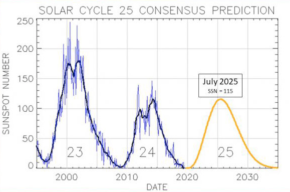
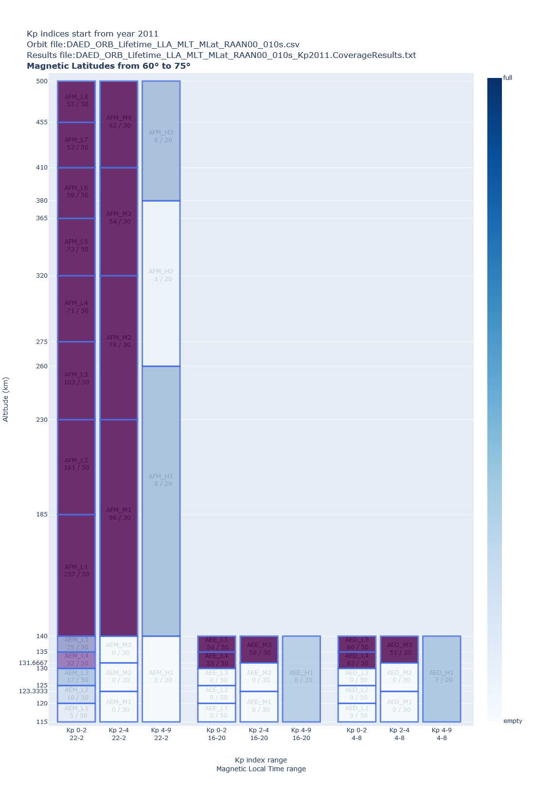
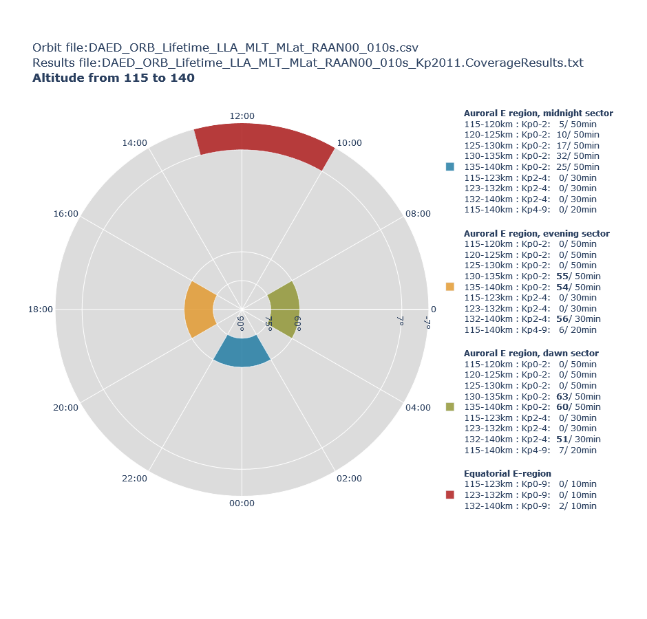
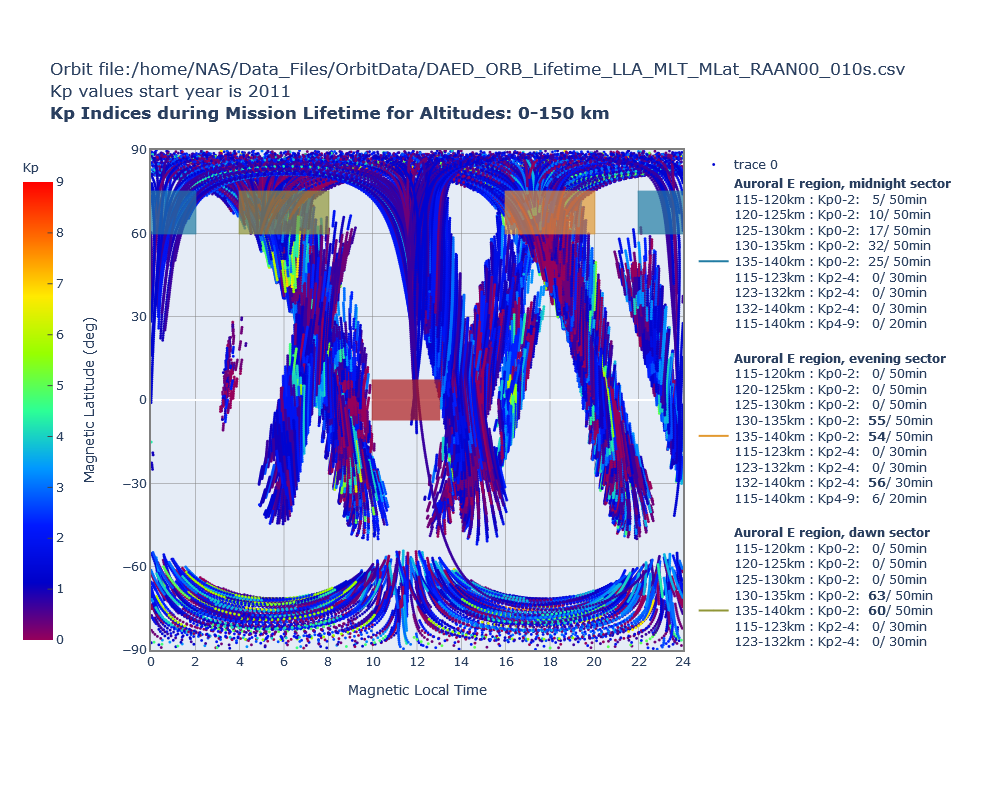

# Satellite Coverage Calculator

## Introduction
Satellites which take in-situ measurements have to pass many times through certain regions. Usually, the cumulative time spent inside each region of interest has to be large enough for the accomplishment of the scienttific mission.
The inputs of this software are:
- A satellite orbit in csv format 
- The description of the regions of interest according to their Altitude, Magnetic Local Time, Magnetic Latitude and Kp-index. Predfined regions are supplied and the user can define new ones freely.
- The Geomagnetic Kp-index files. These are freely available online.

Based on the above data, the software:
- Calculates the cumulative time the satellite spends in each region of interest.
- Plots the results in various charts utilizing the satellite orbit or both the orbit and the time spent in the various regions.

The calculation results of this software facilitate the adjustment of the orbit parameters so that the satellite visits the desirable regions for enough time.
The areas of interest are called 'Bins' and a goal of desirable time of satellite presence is assigned to each bin.
The bin boundaries are defined by ranges of:
1. Magnetic Local Time
2. Magnetic Latitude
3. Altitude
4. Geomagnetic Kp index

## Usage
A sample usage is demonstrated in python code below:
```
# python imports
import ipywidgets as w
import glob
from os import path
# module imports
from data import *
from plot import *

# -------- initialization --------
#set_OrbitFilesPath("") # call this to define another path than the default "./OrbitFiles"
#set_CoverageResultsFilesPath("")  # call this to define another path than the default "./ResultFiles"
#set_GeomagneticIndicesFilesPath("") # call this to define another path than the default "./GeomagneticIndices"
#ClearBins() # call this if you do not want to work with the predefined Bins 
CreateNewBin( "SMP_A1", "Sample region", 22, 2,   70, 80,   100, 150,               4, 9,   20*60 )
readGeomagneticIndices(2015, 2016) # read as few ass possible for speed/memory reasons

# -------- Calculation --------
BinMisses, BinHits, ResultsFilename, Duration = CalculateCoverage( "Sample Execution", 
                                                                   "These results are created for demonstration purposes.", 
                                                                   "OrbitSample.csv", 
                                                                   "2015" )

if(BinMisses==0 and BinHits==0 and Duration==0): # the calculation has been executed before and the results are stored. So load them.
    # -------- Loading --------
    LoadCoverageResults( CoverageResults_Files_Path + "OrbitSample.csv.2015.CoverageResults.txt" )
else:
    print("Number of Bin hits:", BinHits )
    print("Number of Bin misses:", BinMisses)
    print("Results are stored in", ResultsFilename) 
    print("Calculation took", Duration, "sec")
    
# -------- Ploting --------
PlotCoverage_Bars( "My Title" )
PlotCoverage_Bars_GroupedByRegion( "My Title", [ ["SMP"], ["AEE", "AEM","AED"],  ["AFM","CF","PCF"],  ["EPB", "SQ"],  ["EEJ"] ] )
PlotCoverage_PolarChart( "My Title", 1.4 )
PlotOrbit_KpScatter("OrbitSample.csv", 2015, "01-01-2015", "20-01-2015", 100, 220 )
PlotOrbit_Heatmap( "OrbitSample.csv" )
```


## Data


### Orbit data
The main input of this notebook is a satellite orbit. The orbit is described in a csv file as several snapshots of its track. Each snapshot contains information about Time, Latitide, Longitude, Altitude, Magnetic Latitude and Magnetic Local Time of the certain position.
The csv headers are: 
Epoch(UTCG),Lat_GEOD(deg),Lon_GEOD(deg),Height_WGS84 (km),Magnetic Latitude,Magnetic Longitude,MLT
These files should be stored at a local folder (default name is "OrbitFiles").

### Geomagnetic Kp Indices

Geomagnetic Kp indices describe the variation in the geomagnetic field caused mainly by solar radiation changes and also by changes and interactions at the magnetosphere and the ionosphere.
Kp indices are calculated over a 3-hour period and range in 28 steps from 0 (quiet) to 9 (greatly disturbed) with fractional parts expressed in thirds of a unit.
We used Kp indices from previous years as they are recorded from NOAA web site:

  - Explanation: https://www.ngdc.noaa.gov/stp/GEOMAG/kp_ap.html
  - Download location: ftp://ftp.ngdc.noaa.gov/STP/GEOMAGNETIC_DATA/INDICES/KP_AP 
  
There are available data since 1932, separated in one file per year. These files should be stored at a local folder (default name is "GeomagneticIndices").
The user can select which of these years' values to use for the calculations.
Below you can see the solar cycle of the years 1995-2019:
    


### Results
The results of the calculation are stored in plain text files at a local folder (default name is "ResultFiles").
These can be loaded in order to be plotted again.

## Algorithm Description

1. Initialization
    - Define bins: every area of interest is defined by ranges of:
        - Magnetic Local Time
        - Magnetic Latitude    
        - Altitude
        - Kp value
      These data are stored in the Bin class. 
    - Load the Geomagnetic Kp indices into memory. User can select which years he wishes to load (function readGeomagneticIndices()).
2. For each position of the orbit (function CalculateCoverage()):
    - Read Magnetic Latitude, Magnetic Local Time and Altitude from the orbit file
    - Calculate Kp index according to past values.
    - Check if this satellite position falls into any of the predefined bins. 
      In case it does, count it as a hit and add to the time the satellite spends inside the bin.
    - Store the results in text format. It is one line for each bin.
3. Plot the results
    - The plots expose different aspects of the data. They are created by the functions PlotBins_Rectangles(), PlotBins_Rectangles_AlternateGrouping(), PlotBins_Polar(), PlotBins_KpScatter(), PlotAltMaglat()


## Plots
The data resulted after the execution of the current software are the duration the satellite spends inside each bin.
In order to visualize these four dimensional data we utilize several kind of plots.

### Bars

The bars-plot contains one figure per Magnetic Latitude range. It visualizes all the bins as rectangles.
X axis represents the Magnetic Local Time and Kp index of the bin and y axis the Altitude.
Each rectangle is painted accordingly to what percent of the desired time the satellite stays inside the bin. 
(coverage information)

### Polar

The polar-plot contains one figure per Altitude range. It visualizes the position of the bins in respect of 
the Magnetic Latitude (radial axis) and the Magnetic Local Time (angular axis).
The coverage information is displayed at the legend.

### Kp Scatter

The Kp-scatter-plot consists of a single figure. The x-axis represents the Magnetic Local Time and the
y-axis the Magnetic Latitude. The points are colored by their Kp value. The bins positions are depicted as
rectangles on the plot and the coverage information is displayed at the legend.
