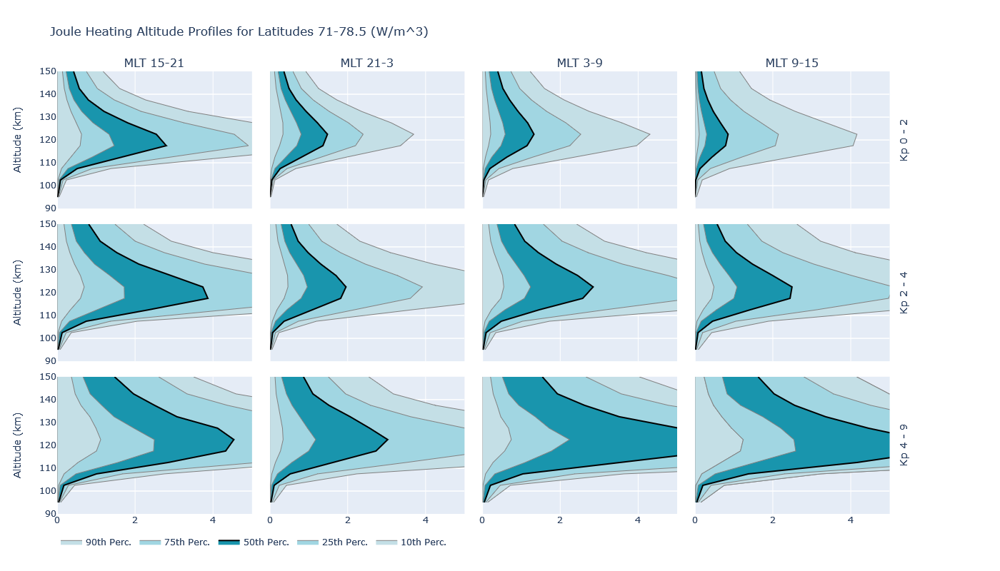
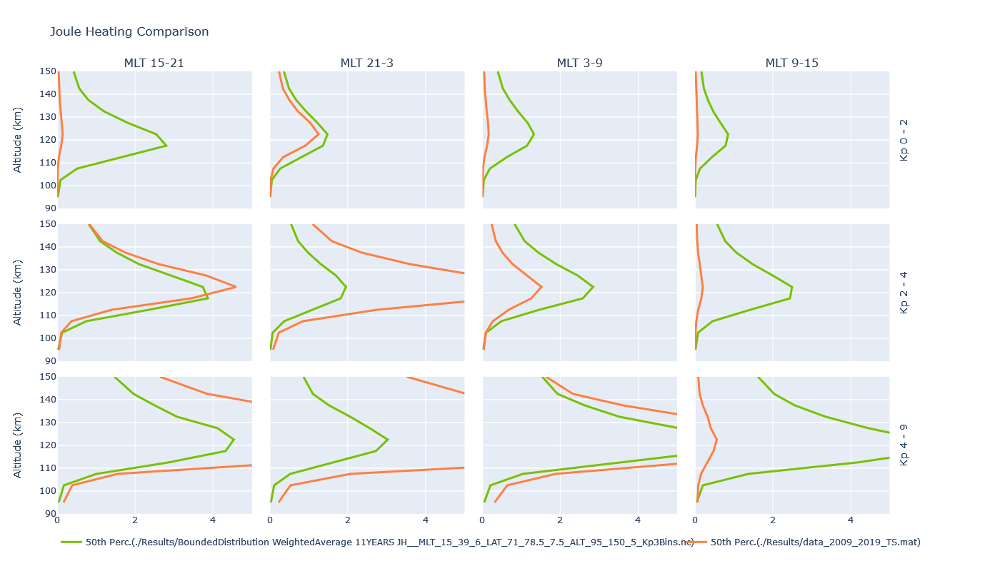
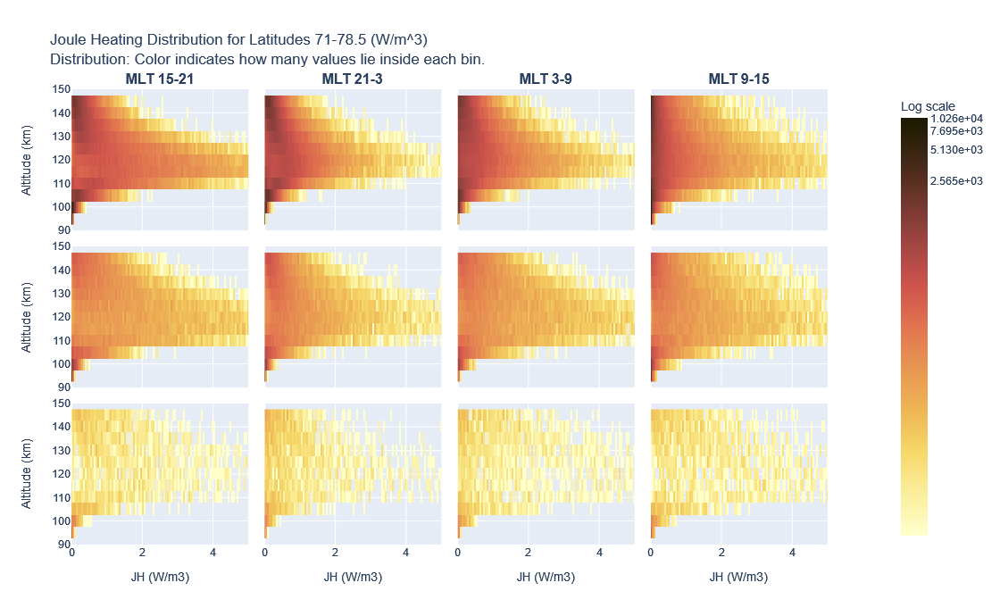

# Altitude Profiles of TIEGCM

## Introduction
The calculation of Altitude Profiles produces charts which provide a useful representation of multi-dimensional geomagnetic data. 
The charts depict Joule Heating, Pedersen conductivity, Hall conductivity etc against altitude and in relation to Kp-index and Magnetic Local Time.
The calculation involves the separation of the data according to their location and geomagnetic properties.
These areas of interest are called 'Bins'. The Bin boundaries are defined by ranges of:
1. Magnetic Local Time
2. Latitude
3. Altitude
4. Geomagnetic Kp index
The values which fall inside the Bins are averaged at each timestep so that the results can be better compared with 
the measuremetns from the EISCAT incoherent scatter radars which study the ionosphere. 
During averaging each value can be assigned a weight according to which latitude it comes from. This gives larger impact to regions having larger area.

## Usage
A sample usage of the software is demonstrated in python code below:
```
import Manager
import Plot
import Data
import PlotComparison
# Calculate Altitude Profiles and save the results in a netcdf file:
Manager.StartCalculating( "./TIEGCMdata/*", "./Results/SampleResult.nc", "JH", "./Results/tmp/", True, 4,   15,39,6 , 71,78.5,7.5, 95,150,5, 3, 100,   1)
# Load the results into data structures:
Bins, BinSums, BinLens, VariableName, Units = Data.LoadResultsCDF( "./Results/SampleResult.nc" )
# Plot the Altitude Profiles:
Plot.plotAltProfiles( "JH", Bins, 0, 4, 10**8, "W/m3", "Joule Heating Altitude Profiles for Latitudes 71-78.5 (W/m^3)")     
# Plot distribution of hits:
Plot.plotColoredDistributions( "JH", Bins, 0, 4, 10**8, "W/m3", "Joule Heating Distribution for Latitudes 71-78.5 (W/m^3)", False )
# Plot a comparison of two result-files:
PlotComparison.plot_AltProfiles_Comparison( "./Results/SampleResult.nc",  "./Results/SampleResult2.nc", "Joule Heating", 0, 4, 10**8, "10^-8 W/m3", "Joule Heating Comparison" )
```


## Data

# TIEGCM
The Thermosphere is described in several TIEGCM files of netCDF type, stored in a user-specified folder. 
The variables stored in the source files are either produced by the TIEGCM simulation or calculated as derived products of the TIEGCM model.  

| Variable description            | Unit             | Name in NetCDF files | Comment        |  
| ------------------------------- | ---------------- | -------------------- | -------------- |  
| UTC timestamp                   | seconds          | time                 |                |  
| Altitude                        | cm               | ZGMID                |                |  
| Latitude                        | degrees          | lat                  |                |  
| Magnetic Latitude               | degrees          | mlat_qdf             |                |  
| Magnetic Local Time             | hours            | mlt_qdf              |                |  
| Kp index                        | 0-9              | Kp                   |                |  
| midpoint levels                 | -                | lev                  |                |  
| Ohmic (Joule) Heating           | W/m3             | Ohmic                | can be plotted |    
| Convection Heating              | W/m3             | Convection_heating   | can be plotted |    
| Wind Heating                    | W/m3             | Wind_heating         | can be plotted |    
| Electric field strength East    | V/m              | EEX                  | can be plotted |   
| Electric field strength North   | V/m              | EEY                  | can be plotted |  
| Total Density                   | g/cm3            | DEN                  | can be plotted |  
| Pedersen Conductivity           | S/m              | SIGMA_PED            | can be plotted |   
| Hall Conductivity               | S/m              | SIGMA_HAL            | can be plotted |  
  
A sample TIEGCM data file can be found at https://drive.google.com/file/d/1Ps-oF6Fu46kuUjVyZEaW8G17TeglF49Z/view?usp=sharing

### Results
The results of the calulation are stored in a netcdf file. 
The variable on which the calulation has been made and the ranges of the Bins are stored in the file.
For every Bin the following information is saved, as well:
 - The summary of the values assigned in the Bin. 
 - The number of the values assigned in the Bin. 
 - The 10th, 25th, 50th, 75th, 90th percentiles of the values assigned in the Bin. 
 - The variance of the values assigned in the Bin. 
 - The distribution of the values assigned in the Bin. 
 - The maximum value assigned in the Bin. 
 - The minimum value assigned in the Bin. 


## Plots
Three different plots can be produced by the software:
- The Altitude Profiles of the selected region and the selected variable. The 10th, 25th, 50th, 75th and 90th percentiles are ploted for each Kp and Magnetic Local Time sub-region.

- A comparison of two different calculations, depicting the 50th percentile of both results on the same figure. 
  The Bins of the two calculations should have the same definitions.
  It is useful for comparing altitude profiles during different time ranges.

- The distribution of the values inside the Bins. The color represents the number of values (hits) inside the corresponding Bin.



## Algorithm Description

- The user selects:
	- a folder where the source netcdf files of the TIEGCM model are stored.
	- a filename to store the results of the calulation.
	- a variable to work with (Joule Heating, Hall Conductivity etc).
	- the ranges of the Bins.
- For each TIEGCM file a new process is spawned in order to process it in parallel:
	- Each process:
		- reads the source data from the tiegcm file.
		- for each timestep parses the TIEGCM grid and locates the values of the variable which fall into the Bins. The average of those values is added into the Bin.
		- the average may be a simple average (sum divided by multitude) or a weighted average. 
		  The weights are calculated according to latitude, so that values coming from small surface areas (=nearer to the poles) have less impact.
		- the averaged values of each Bin are stored into temporary binary files.
	- After all processes have finished, the temporary binary files are read and their data merged at each Bin.
	  The values saved for each Bin are: Sum, Len, 10th, 25th, 50th, 75th, 90th percentiles, Variance, minimum and maximum of the values inside the Bin. 
	  The Distribution of values is also stored, the resolution of which is selected by the user.
	  All these information is stored in a single netcdf file.
