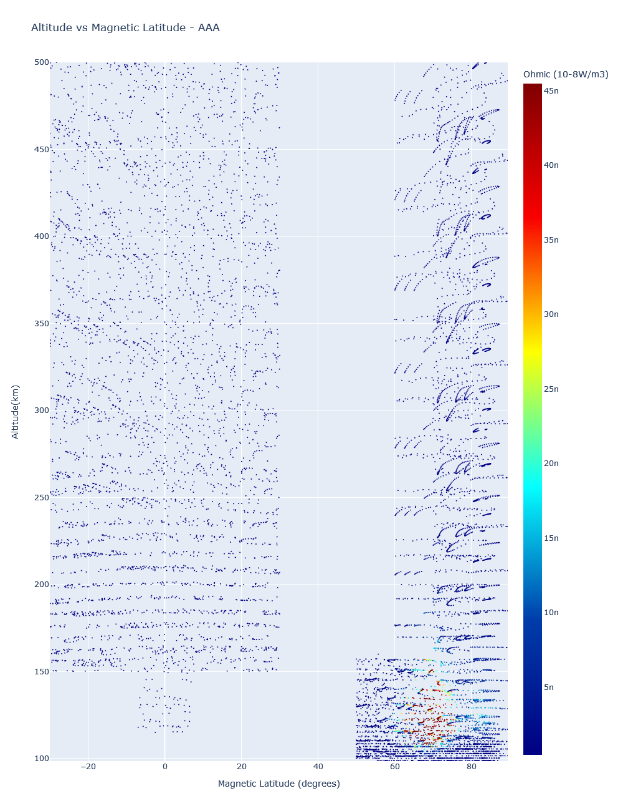
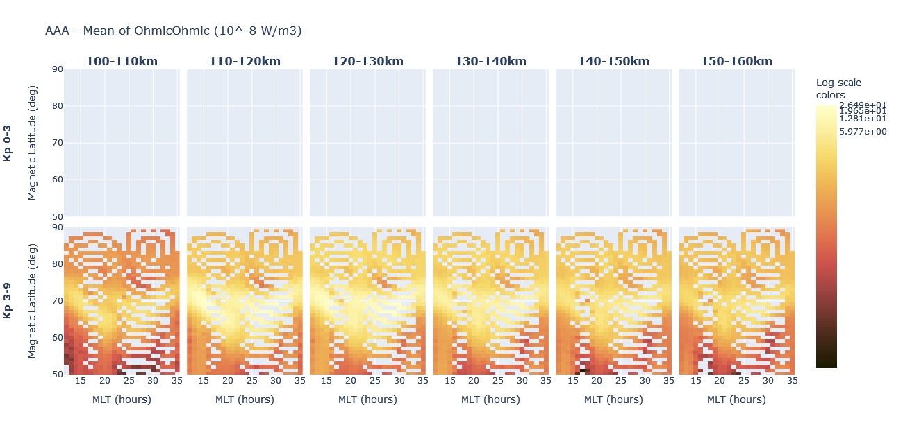
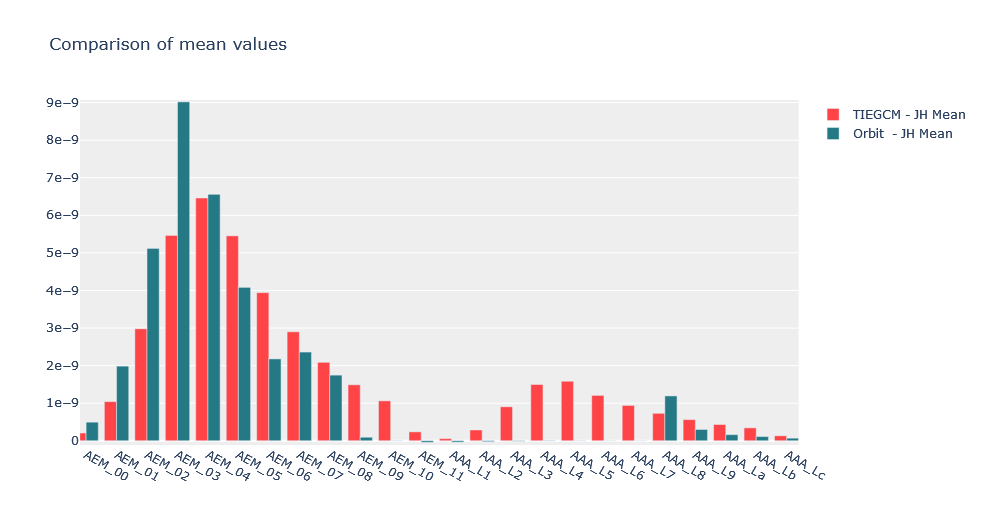
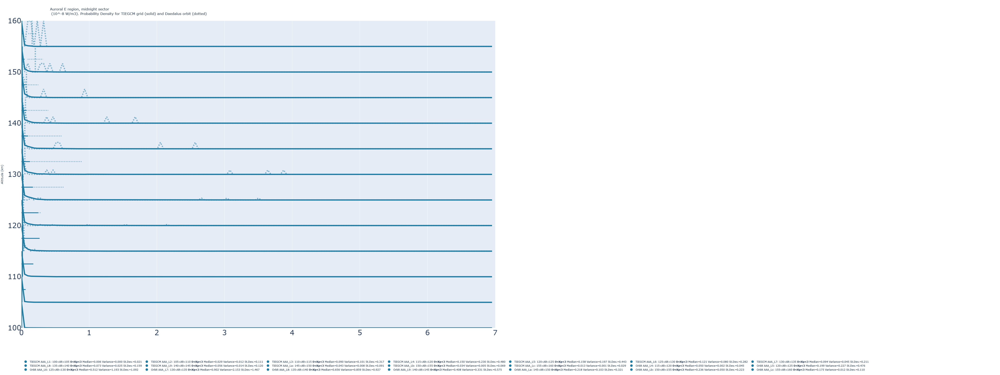
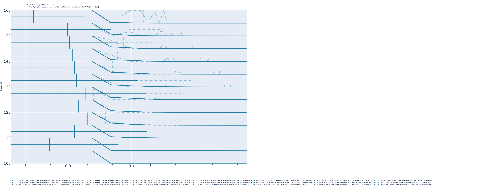

# Thermosphere Statistics

## Introduction
The TIEGCM model provides meauserements along a space-time grid of various variables concerning the electromagnetic dynamics of the Thermosphere.
This software provides several statistical analysis tools which help reveal aspects of the data and describe their physical properties in a meaningful way.
It can also be used to compare the sparse measurements of a satellite with the dense measurements across the model's grid in order to conclude whether a mission can measure adequately a certain area of interest.

#### Areas of interest
Central concepts of this software are the "Region" and the "Bin". The Thermosphere is divided in large areas called "regions" and subdivided further in 'Bins'. 
The boundaries are defined by ranges of:
1. Magnetic Local Time (MLT)
2. Magnetic Latitude (MagLat)
3. Altitude
4. Geomagnetic Kp index
For example, the boundaries of a region called "AEM - Auroral E region, midnight sector" are:
     60 <  Magnetic Latitude  < 75
  22:00 < Magnetic Local Time < 02:00
    115 < Altitude            < 140
      0 < Kp index            < 9
AEM is divided in 9 bins according to smaller ranges of altitude and Kp index.
There are several predefined Bins, which the user can use and he han also delete them and/or create new ones freely.

## Data
Sample data files can be found at https://drive.google.com/drive/folders/1FUY84B_ncAMg-2HSmN2tkmVnNvRI3ezH?usp=sharing

#### TIEGCM grid data 
The Thermosphere is described in several TIEGCM files of netCDF type. These include primary and derived products and are stored in a folder with subfolders for each year (ex: ./TIEGCMdata/2015/tiegcm001.nc is a default path which can be altered).
Each file contains data for 5 days and there are files for the satellite's 3 years lifetime. Inside the file there are data for every 2.5 degrees of Latitude, for every 2.5 degrees of Longitude, for every 2 hours and for 57 pressure levels.
The variables (primary and derived) which are expected to be at the source files (tiegcm and orbit) and are stored to the result files are:  

| Variable description            | Unit             | Name in NetCDF files | Comment        |  
| ------------------------------- | ---------------- | -------------------- | -------------- |  
| UTC timestamp                   | seconds          | time                 |                |  
| Altitude                        | cm               | ZGMID                |                |  
| Latitude                        | degrees          | lat                  |                |  
| Magnetic Latitude               | degrees          | mlat_qdf             |                |  
| Magnetic Local Time             | hours            | mlt_qdf              |                |  
| Kp index                        | 0-9              | Kp                   |                |  
| midpoint levels                 | -                | lev                  |                |  
| Ohmic (Joule) Heating           | W/m3             | Ohmic                | can be plotted |    
| Convection Heating              | W/m3             | Convection_heating   | can be plotted |    
| Wind Heating                    | W/m3             | Wind_heating         | can be plotted |    
| Electric field strength East    | V/m              | EEX                  | can be plotted |   
| Electric field strength North   | V/m              | EEY                  | can be plotted |  
| Total Density                   | g/cm3            | DEN                  | can be plotted |  
| Pedersen Conductivity           | S/m              | SIGMA_PED            | can be plotted |   
| Hall Conductivity               | S/m              | SIGMA_HAL            | can be plotted |  

#### Orbit data
Orbit data contain the measurements a satellite would take along its path, one record for each position. (ex: ./ORBITdata/*.nc is a default path which can be altered).
The file is again a netCDF file and is expected to contain the same variables described above for the TIEGCM model.
The values can be extracted from the TEIGCM model through interpolation by employing  another tool in the current tool-set.

#### Result data
The result data are stored in order to be ploted easier without the time intensive calculation.
The execution and ploting is separated in regions to make results easier to handle and plot.
The result data are stored in netCDF files and contain the measurement values of Joule Heating, Wind Heating, Convection Heating, Density, Electric Field components, Hall Conductivity and Pedersen Conductivity for each Region of Interest. 
Statistical properties like mean and variance are calculated based on these data, which are useful to the plotting functions in order to create figures.


## Plots
Several plots have been constructed to display different aspects of the multi-dimensional data.
The user can select the Region and the Variable he is interested in and plot them.
Both TIEGCM-grid and along-Orbit results are previewed using the same plots as described below.
#### Scatter plots




- function plotVariable():
In these scatter plots each dot represents an instance of a measurement which was taken inside the area of interest. 
The plot usually does not display all the measurements because of their vast number. The plot also contains lines which indicate the Variable's mean and standard deviation calculated on all the values of the area of interest. The mean is displayed as a horizontal line and the standard deviation as a vertical line. 
There is also a scatter plot of Altitude versus Magnetic Latitude where each dot represents a measuremnt inside the area of interest and its color corresponds to the Variable's value.
- function plotVariable_KpSeparated():
The same plots are also available in a form. The Variabe versus Altiude plot display lines which connect the measurements which are successive along the orbit of the satellite (applies only on orbit data).
#### Distribution plots

function Plot_JH_Distribution_perBin():
A distribution plot is created for each area of interest and each bin. This plot can also display fitting functions along the data (An Euler function is usually the best fit).
#### Altitude Profiles

Plots the 10th, 25th, 50th, 75th and 90th percentiles of the variable versus altitude. Sub-figures are displayed for low and high Kp-index and for different Magnetic Local Time ranges.
#### Color Spreads

function plotColorSpread_KpSeparated():
This function creates one plot for each of the mean, standard deviation, 10th percentile, 90th percentile of the variable.
The plot contains several sub-plots, one for each Kp-range and one per 10km of altitude. The value is displayed as a color spot on a Magnetic Latitude - Magnetic Local Time grid.
#### Comparison plot

function plotComparisonOfResults():
Loads two result-files and plots a comparison of their values. A bar-chart is plotted with one bar for each Bin mean.	
It is useful for comparing the results of an orbit to those of tiegcm in order to see if a satellite can describe adequately a region.
#### Probability Density 


function plotPDFperSubBin():
Plots two curves for each Kp-range and for Altitude-range. One curve for the TIEGCM-grid (continuous) and one for the Orbit (dotted). The curves represent the number of points which lie in a range of values of the selected variable.
#### Statistical Tests
function executeStatTest():
Executes several statistical tests in order to compare the distributions of two data sets (Z-test, Wilcoxon, scipy-ranksums, mannwhitneyu). The results are printed as text on the screen


## Usage
A sample usage is demonstrated in python code below:
```
import sys
sys.path.append( "../daedalusmase_global_statistics/" )

from data import *
from plot import *

# Calculate statistics upon data from the satellite orbit. Data are read from files at "./ORBITdata/" and "./TIEGCMdata/" and stored inito "./RESULTS/". "./TIEGCMdata/" is needed to read the corresponding Kp-index for each satellite position
calc_stats_for_orbit( "../../Sample_Data/tiegcm_data/", "../../Sample_Data/orbital_data/", "../RESULTS/orbit_stats.nc" )
# Load the results 
load_results( "../RESULTS/orbit_stats.nc", "Ohmic" )
# Print some general values for each bin
for B in Bins:
    B.printMe()

# Calculate statistics upon data produced by the TIEGCM model. Data are read from files at "./TIEGCMdata/" and stored inito "./RESULTS/"
calc_stats_for_tiegcm("../../Sample_Data/tiegcm_data/", "../RESULTS/tiegcm/")
# Load the results 
load_results( "../RESULTS/tiegcm/", "Ohmic" )     #load_results( "../RESULTS/tiegcm010.stats.nc", "Ohmic" )    
# Print some general values for each bin
for B in Bins:
    B.printMe()

# Plot the most-recently loaded results for a certain region (AAA) and a certain variable (Ohmic heating)
plot_variable( "AAA", "Ohmic" )
plot_variable_KpSeparated( "AAA", "Ohmic" )
plot_distributions( "AAA", "Ohmic")
plot_ColorSpread_KpSeparated( "AAA", "Ohmic" )

# Plot comparison charts between to result-files
plot_comparison( "../RESULTS/tiegcm/", "../RESULTS/orbit_stats.nc", "Ohmic", "Comparison of mean values" )
plot_PDFperSubBin( "../RESULTS/tiegcm/", "../RESULTS/orbit_stats.nc", "AAA", "Ohmic", "10-8W/m3" )

# Print the result of statistical tests and comparisons
execute_stat_test("../RESULTS/tiegcm/", "../RESULTS/orbit_stats.nc", "AAA", "Ohmic")
```

## Algorithms Description
The algorithm seperates into Areas-of-Interest the values of Joule Heating, Pedersen Conductivity, Hall Conductivity, Convection Heating, Wind Correction, JH/mass, JH/pressure and Electric Field strength.
This can be done for both TIEGCM data and Orbit data. The user selects, through the GUI, the type of calculation he desires. The calculation creates result files which the notebook reads when the user wants to plot them.
The plots can display how the values of the selected variable (JH, Pedersen etc) is distributed in relation with Altitude, Magnetic Local Time, Magnetic Latitude and Kp index.

Firstly the Areas-of-Interest are initialized.

If the user selects to work with TIEGCM grid data then the function AssignValuesPerBin_MultipleResultFiles() is called:
- A) For the user-selected area of interest:
     - parse all TIEGCM files and for every point of the space-time grid:
        - check if the point lies inside any of the pre-defined bins.
        - if it does, then assign the Joule Heating value of this point to the correct bin.
     - all the generated data constitute the TIEGCM-grid results
     - the results are stored by the functions CreateResults_CDF() and SaveResults_CDF()
     
If the user selects to work with the orbit data then the function AssignJouleHeatingValuesToBins_AlongOrbit() is called.
- B) For the user-selected area of interest:
    - For every satellite position check if the satellite position lies inside any of the pre-defined bins:
		1. read Altitude, Magnetic-Latitude, Magnetic-Local-Time.
		2. Check if the above values lie inside the ranges of a bin.
	   	   If they do then we have to check the Kp-value following the next step. 		   
		4. Kp index is stored in a TIEGCM file. 
           Read the time of the satellite position and locate the corresponding TIEGCM file.
		5. Read the Kp-value according to the current time.
		6. Now we can check if the satellite position really lies inside a bin.
		   If it does, then assign the Joule Heating value to the correct bin.
    - all the generated data constitute the along-Orbit results
    - the results are stored by the functions CreateResults_CDF() and SaveResults_CDF()

If the user selects to plot the results he must choose a variable as well.
Then the result files are read by the function LoadResults_CDF() and mean, variance etc of the variable are calculated for each Area-of-Interest by the function CalculateStatsOnData().

The user can also select to execute statistical tests. They are executed by the function executeStatTest().

## Attribution
This software uses the Scientific colour maps, created by Fabio Crameri (https://www.fabiocrameri.ch/colourmaps/).

